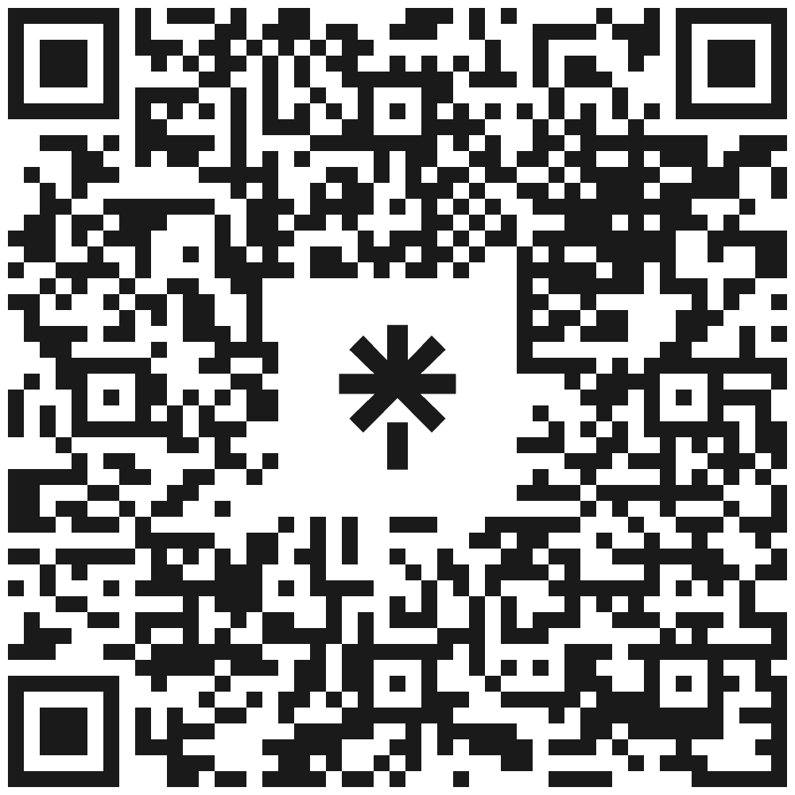

# Unlocking Communication: Lightning Message Channels Demystified

Unlock the Power of Lightning Message Channels! Discover how to revolutionise your Salesforce Lightning Experience with real-time communication between components and tabs. Learn practical use cases, implementation best practices, and unleash the full potential of Lightning Message Channels to create dynamic, interactive user interfaces. Don't miss out on this opportunity to elevate your development skills and enhance user engagement!

## Resources

I maintain a long list of resources used for my research at https://linktr.ee/LightningMessageChannels

Or scan the QR code below

  

